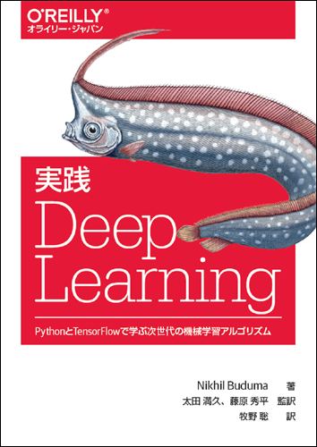

# 実践 Deep Learning

---



---

本リポジトリはオライリー・ジャパン発行書籍『[実践 Deep Learning](https://www.oreilly.co.jp/books/9784873118321/)』（原書名『[Fundamentals of Deep Learning](http://shop.oreilly.com/product/0636920039709.do)』）のサポートサイトです。

## サンプルコード

サンプルコードの解説は本書籍をご覧ください。

### 使用方法

サンプルを実行する前に、必要なライブラリをインストールする必要があります。

```bash
$ pip install -r requirements.txt
```

サンプルコードは`fdl_example`の親ディレクトリから実行することを想定しています。
また、`fdl_example`をパッケージとして認識するために`PYTHONPATH`を指定する必要があります。

**実行例**
```bash
$ export PYTHONPATH=$PYTHONPATH:.
$ python fdl_example/chapter6/autoencoder_mnist.py 2
```

#### 第7章の補足

第7章のサンプルコードを実行するには、 以下のデータが必要となります。

1. [Google News を使って構築した単語の埋め込み表現データ](https://drive.google.com/file/d/0B7XkCwpI5KDYNlNUTTlSS21pQmM/edit)
   - ダウンロードしたファイルを展開後、`fdl_example`の親ディレクトリに配置してください。
2. [CoNLL-2000の品詞データ](http://www.cnts.ua.ac.be/conll2000/chunking/)
   - 上記のリンクからダウンロードできない場合は[Kaggleのページ](https://www.kaggle.com/nltkdata/conll-corpora/data)からダウンロードできます。
     - ダウンロードしたファイルを展開後、`conll2000/train.txt`と`conll2000/test.txt`をそれぞれ`data/pos_data/pos.train.txt`と`data/pos_data/pos.test.txt`に配置してください。

#### 第8章の補足

第8章のサンプルコードを実行するには、bAbiデータセットが必要となります。[bAbiプロジェクトページ](https://research.fb.com/downloads/babi/)から`bAbI Tasks Data 1-20 (v1.2)`をダウンロードして展開後、`tasks_1-20_v1-2/en-10k`を`data/babi-en-10k`にコピーしてください。

## 実行環境

日本語版で検証に使用した各ソフトウェアのバージョンは以下のとおりです。

* OS
  * Ubuntu 16.04 LTS
* ライブラリ
  * tensorflow 1.4.0
  * scikit-learn 0.19.1
  * scipy 1.0.0
  * matplotlib 2.1.2
  * gensim 3.3.0
  * leveldb 0.194
  * tflearn 0.3.2
  * h5py 2.8.0rc1

## 正誤表

まだありません。誤植など間違いを見つけた方は、japan@oreilly.co.jpまでお知らせください。
