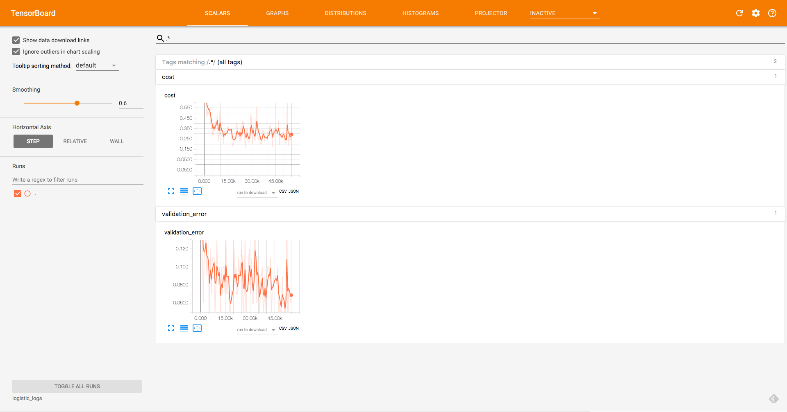
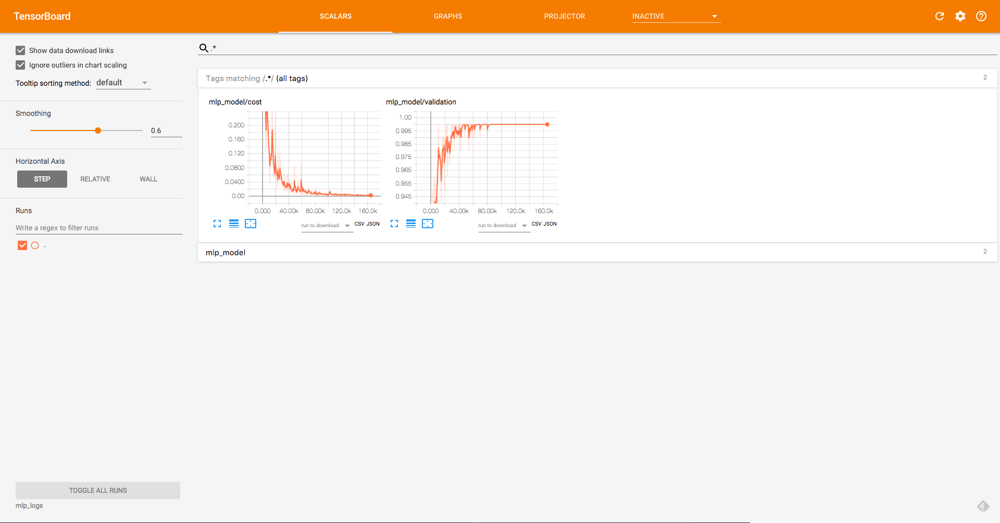

# Chapter 3

## Logistic Regression

### Training

```bash
python logistic_regression.py
```

```
Epoch: 0001 cost: 1.176623925
Validation Error: 0.147599995136
Epoch: 0002 cost: 0.662433274
Validation Error: 0.130999982357
...
Epoch: 0099 cost: 0.282423950
Validation Error: 0.0749999880791
Epoch: 0100 cost: 0.282158490
Validation Error: 0.0749999880791
Optimization Finished!
Test Accuracy: 0.92110002
```

### TensorBoard

```bash
tensorboard --logdir logistic_logs
```



## Multi Layer Perceptron

```bash
python multilayer_perceptron.py
```

```
Epoch: 0001 cost: 1.180891170
Validation Error: 0.188399970531
Epoch: 0002 cost: 0.628710743
Validation Error: 0.165199995041
...
Epoch: 0299 cost: 0.002566195
Validation Error: 0.0198000073433
Epoch: 0300 cost: 0.002549517
Validation Error: 0.0195999741554
Optimization Finished!
Test Accuracy: 0.978699982166
```

### TensorBoard

```bash
tensorboard --logdir mlp_logs
```


