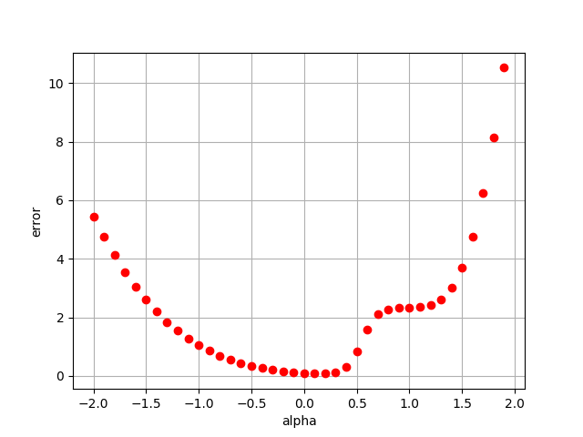
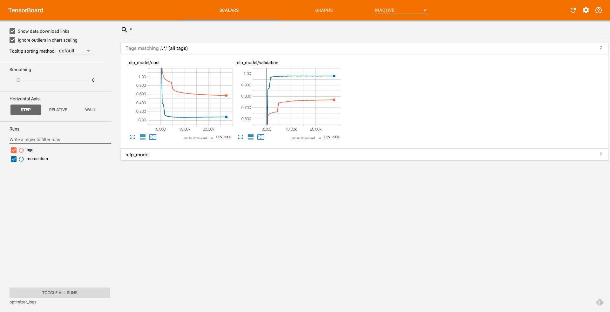

# 勾配降下法を超えて

## 線形補間による極小値の観察

事前に学習済みのcheckpointを用いて、適当な初期値と学習により得られた解の間に局所解が存在するかどうかを調べます。

```bash
python linear_interpolation.py
```



## Momentumの効果の観察

ランダムウォークを例にmomentumの効果を観察します。

```bash
python momentum_rand_walk.py
```


## 最適化手法の比較

最適化手法による正答率や損失の変化を観察します。

```bash
python optimizer_mlp.py <sgd, momentum, adagrad, rmsprop, adam>
```



設定や乱数によって結果は変わりますが、momentumなどの工夫を取り入れることによって学習時間が大幅に短縮されることも珍しくありません。